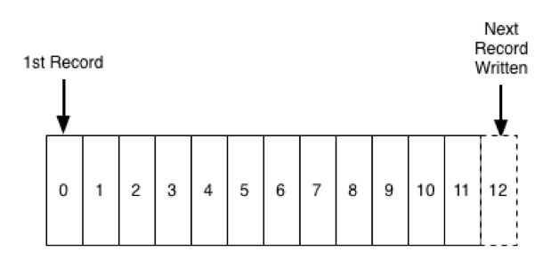

# Dia 002

# Introdução

Todos os eventos publicados para o kafka são armazenados em estrutura que chamamos de tópicos. 
Os tópicos armazenam os dados, que podemos chamar de logs ordenados e imutáveis.

## Como os tópicos se comportam no Kafka

Tópicos são criados para manter os registros dos nossos dados armazenados, toda informação publicada é gerada um evento,
este evento é enviado para o seu tópico.

Geralmente os tópicos são criados para abstrair nossas regras de negócio, pense em um evento onde vamos salvar um
determinado usuário, neste evento sempre tem o body(estrutura de dados) contendo a informação do usuário, esta mensagem 
será enviada para o tópico de salvar usuário, onde ficará armazenado esse dado, que em algum momento um consumidor vai 
ler e executar a tarefa de salvar.

Exemplo:

Os tópicos do Kafka são logs de registro, cada tópico pode ser criado e configurado para armazenar os dados por tempo 
indeterminado ou até atingir um tamanho específico, como se fosse um bando de dados.

A simplicidade do log e a imutabilidade do conteúdo nele são fundamentais para o sucesso do Kafka como um componente 
crucial na infraestrutura dos nossos projetos.
